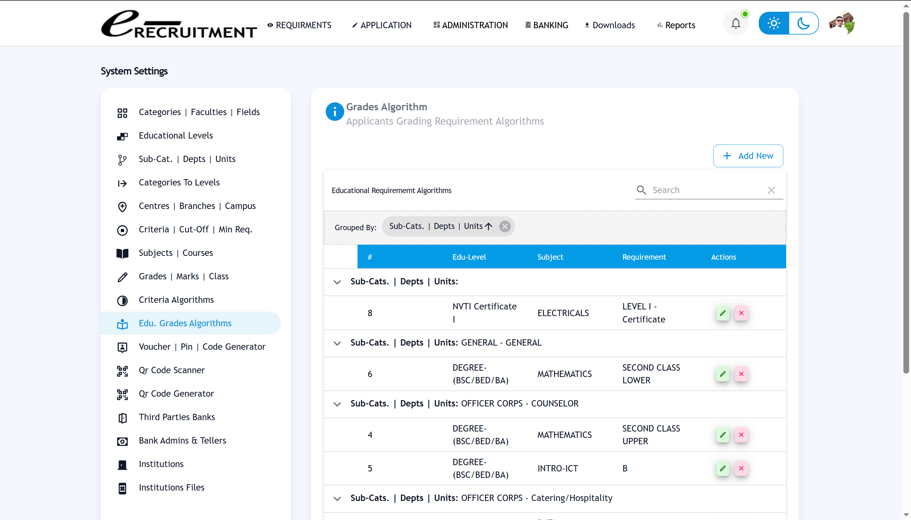

# E-Recruitment System

> **IMPORTANT NOTICE**: This repository contains **partial source code** for demonstration purposes only. The core recruitment module contains proprietary business logic and sensitive algorithms that are **NOT included** in this public repository.

A comprehensive web application built with Next.js and React for managing recruitment processes, applicant management, and administrative operations.

## **What's Included vs. What's Protected**

### **What You'll Find Here:**
- **Core UI Components**: Reusable Material-UI components and layouts
- **Authentication System**: JWT-based authentication framework
- **Basic Modules**: User management, notifications, and system administration
- **Project Structure**: Complete file organization and architecture
- **Configuration**: Environment setup and build configuration
- **Documentation**: Comprehensive setup and usage guides

### **What's Protected (Not Included):**
- **Recruitment Module**: Core business logic and algorithms
- **Banking Integration**: Voucher system and payment processing
- **Application Processing**: Multi-step forms and criteria matching
- **Reporting Engine**: Advanced analytics and reporting features
- **API Endpoints**: Backend business logic and database operations

## **Why This Approach?**

This project represents significant commercial value and technical sophistication. While I'm happy to share some architectural patterns, UI components, and development approach, the core business logic remains proprietary to protect:

- **Intellectual Property**: Unique algorithms and business processes
- **Commercial Value**: Revenue-generating features and integrations
- **Competitive Advantage**: Specialized recruitment and banking features
- **Client Confidentiality**: Sensitive business requirements and data models

## **Screenshots & Demo**

While the full system isn't available, here are some screenshots showcasing the capabilities:

**Note**: I cannot provide a live demo link due to sensitive information and proprietary business logic contained in the system.

### Home Page

*Main home page with system overview*

### Registration Interface

*Alternative registration interface view*

### Application Dashboard

*Comprehensive applicant management interface*

### Registration System

*Multi-step application registration process*

### Banking Integration

*Voucher-based payment processing*

### Sales Management

*Bank teller sales interface*

### Settings & Administration

*Administrative configuration panel*

### Grading Algorithm System

*Advanced algorithm configuration for applicant evaluation*


### Sales Reporting Page

*Sales reporting and analytics interface*


## **Technology Stack**

- **Frontend**: Next.js 13+, React 18+, TypeScript
- **UI Framework**: Material-UI (MUI) with custom components
- **State Management**: Redux Toolkit
- **Authentication**: JWT-based authentication system
- **Styling**: Tailwind CSS with custom themes
- **Icons**: React Icons
- **Database**: MongoDB with Mongoose ODM
- **File Upload**: Cloudinary integration
- **Notifications**: Email (Nodemailer) and SMS integration

## **Prerequisites**

- Node.js (v16 or higher)
- npm or yarn package manager
- MongoDB database
- Cloudinary account (for file uploads)
- Email service provider (for notifications)
- SMS service provider (optional)

## **Installation**

### 1. Clone the Repository
```bash
git clone https://github.com/edcarlos-92/e-recruitment-system.git
cd e-recruitment-system
```

### 2. Install Dependencies
   ```bash
npm install
# or
   yarn install
   ```

### 3. Environment Configuration
   ```bash
   cp example.env .env.local
   ```
   
Edit `.env.local` and configure the following variables:

#### Required Variables
```env
# Database
MONGODB_URI=mongodb://localhost:27017/e_recruit

# JWT Authentication
JWT_SECRET_KEY=your-super-secret-jwt-key

# Cloudinary (File Upload)
CLOUDINARY_CLOUD_NAME=your-cloudinary-cloud-name
CLOUDINARY_API_KEY=your-cloudinary-api-key
CLOUDINARY_API_SECRET=your-cloudinary-api-secret

# Email Configuration
EMAIL_HOST=smtp.gmail.com
EMAIL_PORT=587
EMAIL_USER=your-email@gmail.com
EMAIL_PASS=your-app-password
```

### 4. Run the Application
   ```bash
# Development mode
npm run dev
# or
   yarn dev
   ```

### 5. Access the Application
Open [http://localhost:3000](http://localhost:3000) in your browser.

**Note**: You'll see the UI components and basic functionality, but the core recruitment features will not be available.

## **Project Structure**

```
src/
├── @edcarlos/                 # Core application components (partial)
│   ├── core/                # Reusable UI components
│   ├── libs/                # Utility libraries (basic)
│   ├── services/            # API services (authentication only)
│   └── utility/             # Helper functions and hooks
├── modules/                  # Feature modules (basic modules only)
│   ├── auth/                # Authentication module
│   ├── userAccount/         # User account management
│   ├── SystemUsers/         # System user administration
│   └── macTech/             # PROTECTED - Core recruitment module
├── pages/                    # Next.js pages and API routes (partial)
│   ├── api/                 # Backend API endpoints (basic)
│   └── e-recruit/           # PROTECTED - Frontend pages
├── redux/                    # State management (partial)
├── types/                    # TypeScript type definitions (partial)
└── shared/                   # Shared constants and utilities
```

**Legend:**
- **Available**: Included in this repository
- **Protected**: Not included (proprietary)

## **Available Scripts**

- `npm run dev` - Start development server
- `npm run build` - Build for production
- `npm run start` - Start production server
- `npm run lint` - Run ESLint
- `npm run type-check` - Run TypeScript type checking

## **What You Can Learn**

This repository demonstrates:

- **Modern React Architecture**: Next.js 13+ with App Router
- **Component Design**: Reusable Material-UI components
- **State Management**: Redux Toolkit patterns
- **Authentication**: JWT implementation
- **TypeScript**: Type-safe development
- **Project Organization**: Scalable folder structure
- **UI/UX Patterns**: Professional interface design

## **Other Projects & Demos**

I have other repositories with complete business logic available for free that you can explore:

### **Insurance Policy Management System**
- **Repository**: [https://github.com/edcarlos-92/insurance-policy](https://github.com/edcarlos-92/insurance-policy)
- **Live Demo**: [insurrance-records.vercel.app](https://insurrance-records.vercel.app/)
- **Features**: Policy management, client management, payment tracking, dashboard analytics, multi-currency support
- **Tech Stack**: Next.js, React, TypeScript, Material-UI, Redux

### **Barber Shop Management System**
- **Repository**: [https://github.com/edcarlos-92/barbering-shop-management](https://github.com/edcarlos-92/barbering-shop-management)
- **Live Demo**: [barber-shop-mu.vercel.app](https://barber-shop-mu.vercel.app/)
- **Features**: Appointment scheduling, customer management, service tracking, payment processing
- **Tech Stack**: Next.js, React, TypeScript, Material-UI, Redux

These projects demonstrate my ability to build complete, production-ready applications with full business logic, authentication, and real-world functionality.

## **Why Limited Source Code Access?**

This repository contains only partial source code due to non-disclosure agreements and proprietary business logic that I cannot share publicly. The core recruitment algorithms, banking integration, and business processes are protected to maintain confidentiality with clients and preserve the commercial value of the system.

While I cannot provide the complete source code, I'm happy to discuss the technical implementation, architectural decisions, and development approach through other means. The included components demonstrate the quality and structure of the full system.

If you're interested in learning more about the technical implementation or have questions about the architecture, feel free to reach out for a technical discussion.

## **About This Repository**

This repository showcases some components from a larger recruitment system I built. The included components demonstrate:

- Modern React architecture patterns
- Professional UI component design
- Authentication system implementation
- Project organization best practices

## **License**

This repository is licensed under the MIT License for the included components. The recruitment module remains proprietary and is not covered by this license.

## **Support**

For questions about:
- **Included Components**: Create an issue in this repository

---

**E-Recruitment System** - Showcasing modern web development with enterprise-grade architecture.

*This repository is to demonstrate technical capabilities while protecting intellectual property and commercial interests.*